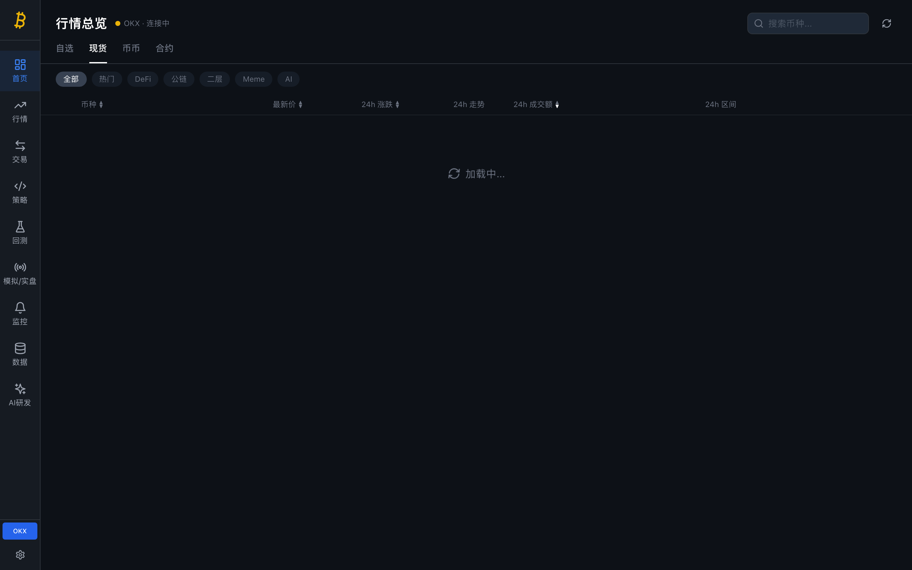
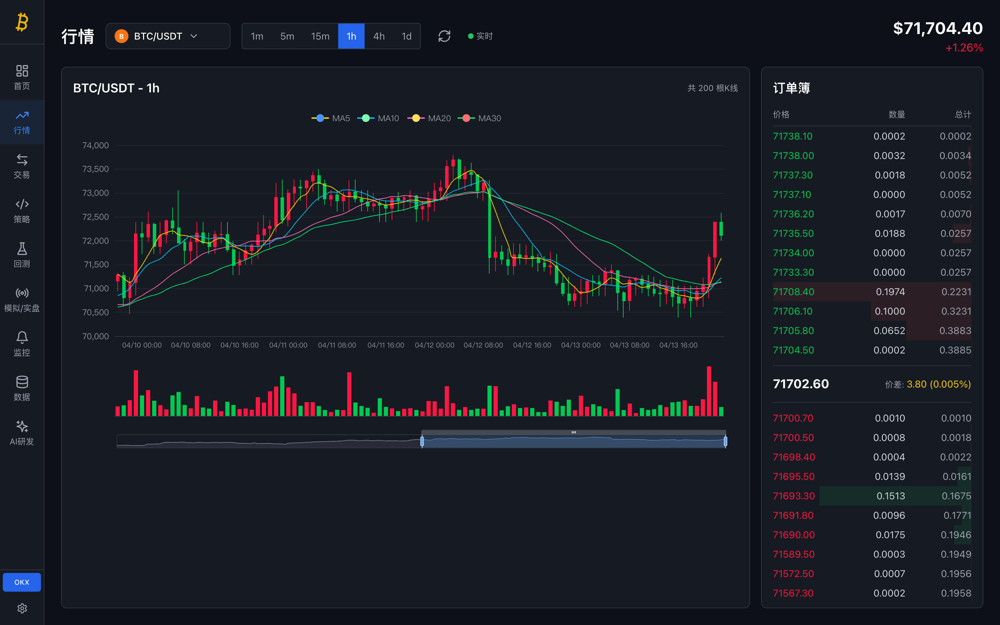
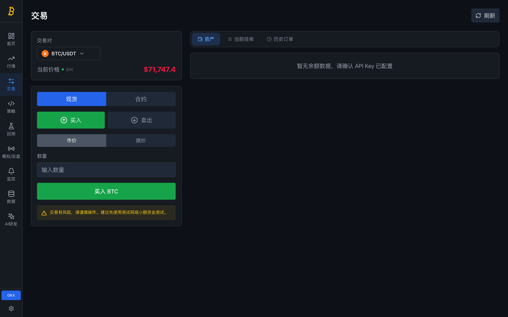
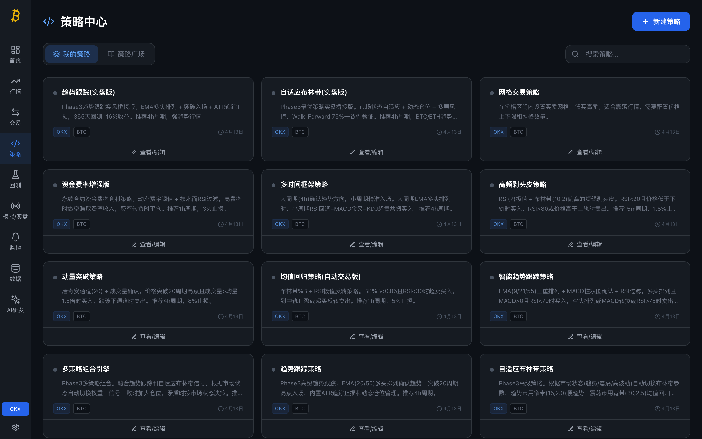
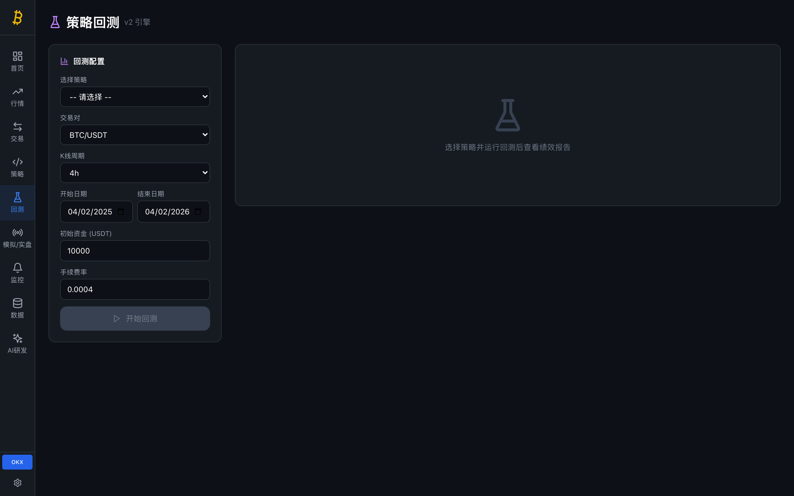
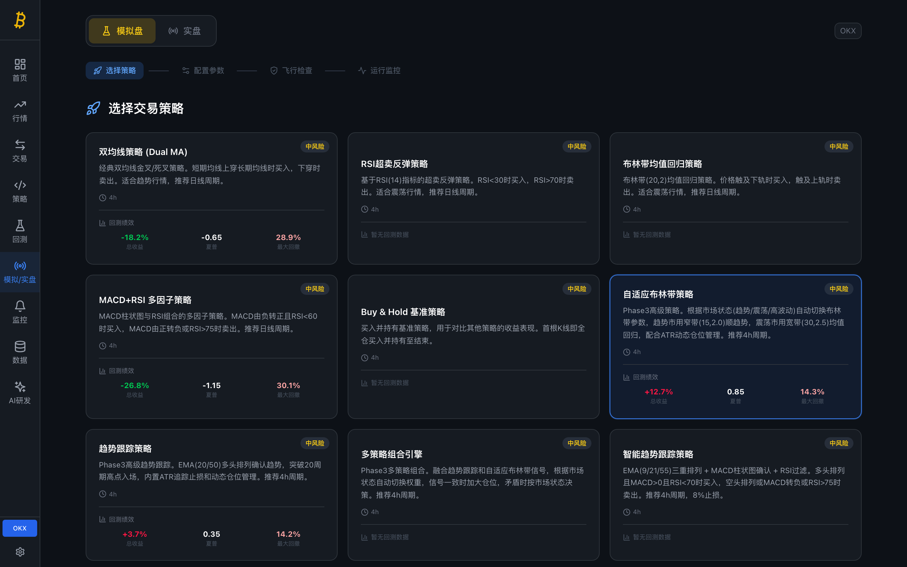
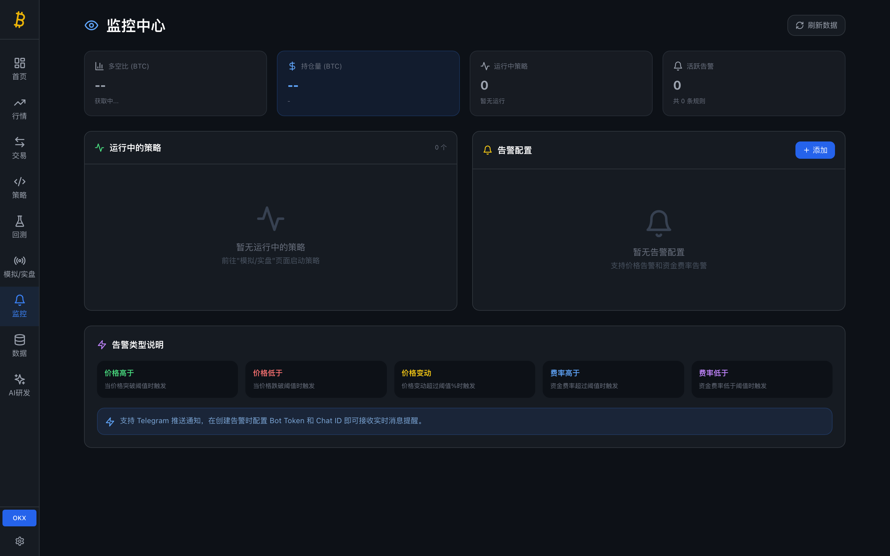
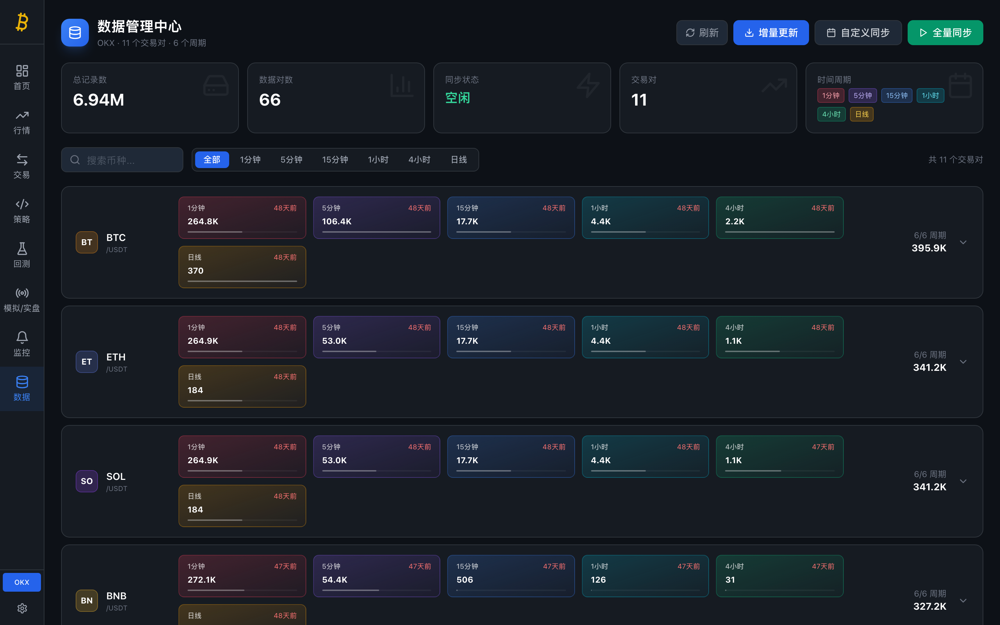
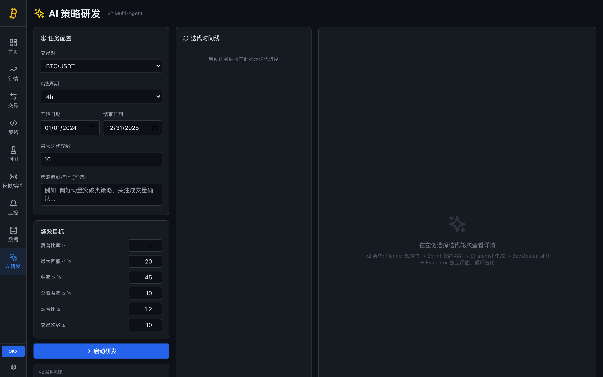

# BitPro — 加密货币量化交易平台

<p align="center">
  <strong>全栈量化交易平台，集行情监控、策略回测、模拟/实盘交易、AI 多 Agent 策略研发于一体。</strong>
</p>

<p align="center">
  
  
  
  
  
  
</p>

---

## 亮点特性

- **9 大功能模块** — 首页看板 · 行情监控 · 交易下单 · 策略中心 · 策略回测 · 模拟/实盘 · 监控告警 · 数据管理 · AI 策略研发
- **17 个内置量化策略** — 从经典双均线到 AI 生成的自适应策略，覆盖趋势跟踪、均值回归、动量突破、网格交易等主流策略类型
- **自研 v2 回测引擎** — 逐 bar 模拟，30+ 技术指标，多空双向，全局风控，毫秒级回测
- **AI 多 Agent 闭环** — GAN-inspired 架构，Planner → Strategist → Backtester → Evaluator 循环迭代，自动生成并优化策略
- **实时 WebSocket 推送** — Ticker、K 线、订单簿、资金费率多通道订阅
- **多层风控体系** — 仓位管理、止损止盈、熔断机制、资金限额、交易频率控制
- **一键部署** — `./init.sh` 初始化 + `./start.sh` 启动，3 分钟上手

---

## 技术栈

| 层 | 技术 |
|---|---|
| 后端 | Python 3.11 · FastAPI · Uvicorn · SQLite · CCXT |
| 前端 | React 18 · TypeScript · Vite · TailwindCSS · Zustand · ECharts |
| 交易所 | OKX (现货 + 合约)，通过 CCXT 统一接口 |
| AI Agent | 通义千问 Qwen (OpenAI 兼容 API) · 多 Agent 闭环架构 |
| 实时通信 | WebSocket 多通道订阅 (Ticker / K 线 / 订单簿 / 资金费率) |
| 运维 | Bash 脚本一键启停 · 日志轮转 · 健康检查 · CI 脚本 |

---

## 模块截图

### 首页看板

> 全市场行情总览，支持现货/币币/合约分类筛选，内置热门、DeFi、公链、Meme、AI 等板块标签，实时展示币种价格、24h 涨跌幅、成交额和价格走势，支持自选收藏和搜索。



### 行情监控

> 专业级 K 线图表和订单簿深度图，支持 BTC/USDT 等主流交易对，提供 1m/5m/15m/1h/4h/1d 多个时间周期切换，WebSocket 实时推送最新价格和涨跌变动。



### 交易下单

> 现货/合约双模式，限价/市价下单，实时价格展示。资产面板、当前挂单和历史订单三栏切换，买入/卖出快捷操作，内置风险提示。



### 策略中心

> 策略管理面板，展示所有策略的状态、绑定交易对、收益情况，支持策略启停控制、参数配置、脚本编辑和新建策略。



### 策略回测

> 自研 v2 回测引擎，逐 bar 模拟交易，30+ 技术指标内置。BigQuant 风格核心指标面板 (累计收益/年化/夏普/胜率/盈亏比/最大回撤)，策略收益率 vs 基准指数 vs 相对收益多曲线对比图表，回撤区域可视化，支持按时间范围缩放。



### 模拟盘 / 实盘交易

> 策略实盘运行面板，模拟盘/实盘一键切换，选择策略 → 配置参数 → 飞行检查 → 运行监控四步流程。策略卡片展示回测收益率、夏普比率、最大回撤等关键指标，支持风险等级标签。



### 监控中心

> 系统状态仪表盘，多空比、持仓量、运行中策略数、活跃告警数一览。告警规则配置支持价格突破/跌破/波动、资金费率阈值等五种类型，支持 Telegram 消息推送和 Webhook 通知。



### 数据管理中心

> K 线历史数据同步管理，资金费率归档，支持按交易对、时间范围查询和数据导出，展示数据覆盖率和同步进度。



### AI 策略研发 (v2 Multi-Agent)

> GAN-inspired 多 Agent 闭环系统：Planner 规格书 → Sprint 合约协商 → Strategist 生成 → Backtester 回测 → Evaluator 独立评估，循环迭代直至达标。支持 5 维度雷达图评分、方向决策 (Pivot/Refine)、合约验收。



---

## 内置量化策略

开箱即用的 17 个策略，覆盖主流量化交易方向：

### 经典入门

| 策略 | 说明 | 推荐周期 |
|---|---|---|
| 双均线策略 (Dual MA) | 经典双均线金叉/死叉，适合趋势行情 | 日线 |
| RSI 超卖反弹 | RSI(14) 超卖买入、超买卖出 | 日线 |
| 布林带均值回归 | 布林带(20,2) 下轨买入、上轨卖出，适合震荡市 | 日线 |
| MACD+RSI 多因子 | MACD 柱状图翻正 + RSI 过滤，多因子共振 | 日线 |
| Buy & Hold 基准 | 买入持有基准线，用于策略对比评估 | — |

### 进阶策略

| 策略 | 说明 | 推荐周期 |
|---|---|---|
| 智能趋势跟踪 | EMA(9/21/55) 三重排列 + MACD 柱状图 + RSI 过滤 | 4h |
| 均值回归 (自动交易版) | 布林带 %B + RSI 极值反转，内置 ATR 追踪止损 | 1h |
| 动量突破 | 唐奇安通道(20) + 成交量确认突破 | 4h |
| 高频剥头皮 | RSI(7) 极值 + 布林带(10) 偏离，快进快出 | 15m |
| 多时间框架 | 大周期(4h) 确认趋势 + 小周期 RSI/MACD/KDJ 精准入场 | 4h |
| 资金费率增强版 | 永续合约资金费率套利 + RSI 技术面过滤 | 1h |
| 网格交易 | 价格区间内设置买卖网格，低买高卖，适合震荡行情 | — |

### Phase3 高阶策略

| 策略 | 说明 | 推荐周期 |
|---|---|---|
| 自适应布林带 | 市场状态自适应参数 (趋势/震荡/高波动) + 动态仓位 | 4h |
| 趋势跟踪 | EMA 多头排列 + 20 周期突破 + ATR 追踪止损 | 4h |
| 多策略组合引擎 | 融合趋势跟踪 + 自适应布林带，信号投票 + 动态权重 | 4h |
| 自适应布林带 (实盘版) | Phase3 最优策略实盘桥接，Walk-Forward 75% 验证 | 4h |
| 趋势跟踪 (实盘版) | 趋势跟踪实盘桥接，365 天回测 +16% 收益验证 | 4h |

---

## v2 回测引擎

### 核心特性

- **逐 Bar 模拟** — 每根 K 线逐步更新仓位、检查风控、执行策略、计算权益
- **多空双向** — 支持做多/做空/平仓，可配置最大杠杆倍数
- **纯函数策略** — `strategy(ctx)` + `setup_indicators(ctx)` 纯函数模型，安全可测试
- **本地优先数据** — SQLite 缓存 K 线数据，不足时自动从交易所补数据
- **全局风控** — 每根 Bar 自动检查止损、止盈、追踪止损
- **时间周期** — 支持 1m / 5m / 15m / 30m / 1h / 4h / 1d / 1w

### 内置技术指标 (30+)

| 类别 | 指标 |
|---|---|
| 均线 | SMA, EMA, WMA (支持任意周期) |
| 趋势/动量 | MACD (线/信号/柱状图), RSI, KDJ, Stochastic RSI |
| 波动/通道 | 布林带 (BBANDS), ATR, 波动率 (VOLATILITY) |
| 成交量 | OBV, VWAP |
| 辅助 | CROSS_ABOVE, CROSS_BELOW, HIGHEST, LOWEST, PERCENT_RANK |

### 绩效指标

累计收益 · 年化收益率 · 夏普比率 · Sortino 比率 · Calmar 比率 · 最大回撤 (幅度+持续天数) · 胜率 · 盈亏比 · 期望收益 · 最大连胜/连亏 · 月度收益分布 · 总手续费 · 平均持仓 K 线数 · 资金曲线

---

## AI 多 Agent 策略研发 (v2)

基于 [Anthropic Harness Design](https://www.anthropic.com/engineering/harness-design-long-running-apps) 论文思想构建的 GAN-inspired 多 Agent 闭环系统：

```
Planner (规格书) → [Sprint 合约协商 → Strategist (生成) → Backtester (回测) → Evaluator (评估)] × N
```

### Agent 分工

| Agent | 职责 |
|---|---|
| **Planner** | 将用户简短 prompt 扩展为完整策略规格书 (市场分析 + 候选方向 + 迭代计划) |
| **Strategist** | 生成 Python 策略代码，支持 Sprint 合约约束 |
| **Backtester** | 在 v2 引擎中执行回测 (无 LLM，纯计算) |
| **Evaluator** | 独立于 Generator 的评估者，5 维度量化打分 + Pivot/Refine 方向决策 |

### 核心机制

- **分离生成与评估** — 消除 LLM 自我评估偏见
- **多维度评分** — 风控 (25%) · 盈利 (25%) · 稳健 (20%) · 逻辑 (15%) · 原创 (15%)
- **Sprint 合约** — 每轮迭代前 Strategist 和 Evaluator 协商验收标准
- **Context Reset** — 每轮结构化交接文档，防止上下文退化
- **Pivot/Refine** — 根据评分趋势自动决定优化当前策略还是换方向
- **代码沙箱** — AST 静态分析 + 受限 exec + 白名单 import，防止 AI 生成危险代码

---

## 风控体系

### 交易风控 (RiskManager)

| 类别 | 机制 |
|---|---|
| **仓位管理** | 固定比例、Kelly 公式 (半 Kelly 上限)、ATR 动态仓位 |
| **止损止盈** | 固定百分比、固定金额、ATR 追踪、百分比追踪、时间止损、保本止损 |
| **资金限额** | 单笔最大仓位、总持仓上限、每笔风险限额、最大杠杆 |
| **亏损保护** | 每日/每周亏损上限、总回撤上限 |
| **频率控制** | 每小时/每日最大交易次数、亏损冷却期、止损冷却期 |
| **市场过滤** | 价差门槛、最小成交量、波动率过滤、最小/最大订单金额 |
| **熔断机制** | 触发条件自动停止交易，需手动重置 (`reset_circuit_breaker`) |

### 回测级风控

每根 K 线自动检查全局止损 (`stop_loss`)、止盈 (`take_profit`)、追踪止损 (`trailing_stop`)，强制平仓并记录原因。

### AI 代码沙箱

- **AST 静态分析** — 禁止 `os`/`sys`/`subprocess` 等危险模块
- **受限执行** — 精简 `__builtins__`，仅白名单 `numpy`/`math`/指标函数
- **函数签名校验** — 必须实现 `strategy(ctx)` 接口

---

## 实时数据 (WebSocket)

```
ws://localhost:8889/api/v1/ws
```

### 协议

```json
{ "action": "subscribe", "channel": "ticker", "exchange": "okx", "symbol": "BTC/USDT" }
```

### 频道

| 频道 | 推送频率 | 说明 |
|---|---|---|
| `ticker` | ~2s | 单币种实时价格、涨跌幅 |
| `tickers` | ~3s | 批量主流币种行情 |
| `funding` | ~30s | 资金费率 (永续合约) |
| `kline` | 按周期 | K 线数据 |
| `orderbook` | 实时 | 订单簿深度 |

---

## 项目结构

```
BitPro/
├── backend/
│   ├── app/
│   │   ├── api/
│   │   │   ├── endpoints/          # v1 REST API
│   │   │   └── v2/endpoints/       # v2 REST API
│   │   ├── core/                   # 配置、错误处理
│   │   ├── db/                     # SQLite 数据层
│   │   ├── exchange/               # 交易所适配 (OKX/CCXT)
│   │   ├── services/
│   │   │   ├── agent/              # AI 多 Agent 系统
│   │   │   │   ├── orchestrator.py     # 编排器
│   │   │   │   ├── planner_agent.py    # 规划 Agent
│   │   │   │   ├── strategist_agent.py # 策略生成 Agent
│   │   │   │   ├── backtester_agent.py # 回测 Agent
│   │   │   │   ├── evaluator_agent.py  # 评估 Agent
│   │   │   │   ├── code_sandbox.py     # 代码沙箱
│   │   │   │   └── llm_client.py       # LLM 客户端
│   │   │   ├── strategy_backtest.py    # v2 回测引擎
│   │   │   ├── strategy_registry.py    # 策略注册表
│   │   │   ├── indicators.py           # 30+ 技术指标
│   │   │   ├── market_regime.py        # 市场状态识别
│   │   │   ├── risk_manager.py         # 风控管理器
│   │   │   ├── trading_service.py      # 交易服务
│   │   │   ├── alert_service.py        # 告警服务
│   │   │   └── telegram_notifier.py    # Telegram 通知
│   │   └── strategies/             # 策略基类
│   ├── .env.example
│   └── requirements.txt
├── frontend/
│   └── src/
│       ├── pages/                  # 9 个功能页面
│       ├── components/             # K 线图、订单簿、资金曲线等组件
│       ├── hooks/                  # WebSocket hook
│       ├── stores/                 # Zustand 状态管理
│       └── api/                    # Axios API 客户端
├── data/seed/                      # 种子数据 (17 个内置策略)
├── scripts/
│   ├── check.sh                    # CI 检查
│   └── seed_strategies.py          # 种子策略导入脚本
├── init.sh                         # 首次初始化
├── start.sh                        # 一键启动
├── stop.sh                         # 一键停止
├── restart.sh                      # 重启
├── status.sh                       # 状态检查
└── deploy.sh                       # 部署脚本 (--clean / --update / --check)
```

---

## 快速开始

### 环境要求

- Python 3.11+
- Node.js 18+
- 代理软件 (国内访问 OKX 需要)

### 1. 克隆 & 初始化

```bash
git clone https://github.com/Shadowell/BitPro.git
cd BitPro
./init.sh
```

自动完成：环境检查 → 创建虚拟环境 → 安装前后端依赖 → 初始化数据库 → 导入 17 个内置策略。

### 2. 配置环境变量

```bash
vim backend/.env
```

```bash
# 必填 — OKX 交易所 API
OKX_API_KEY=your_key
OKX_API_SECRET=your_secret
OKX_PASSPHRASE=your_passphrase

# 必填 (国内) — 代理
HTTP_PROXY=http://127.0.0.1:7890
HTTPS_PROXY=http://127.0.0.1:7890

# 可选 — AI Agent 功能
QWEN_API_KEY=your_qwen_api_key
QWEN_MODEL=qwen3.5-flash
```

### 3. 启动

```bash
./start.sh
```

| 服务 | 地址 |
|---|---|
| 前端 | http://localhost:8888 |
| 后端 API | http://localhost:8889 |
| API 文档 (Swagger) | http://localhost:8889/docs |

### 4. 运维命令

```bash
./status.sh                   # 查看服务状态 (--json 机器可读)
./stop.sh                     # 停止所有服务 (--force 强制)
./restart.sh                  # 重启
./start.sh --backend-only     # 只启动后端
./start.sh --frontend-only    # 只启动前端
./deploy.sh --update          # 更新依赖 (保留数据)
./deploy.sh --clean           # 全量清理重建
```

---

## API 概览

双版本 API，v2 为推荐版本：

| 模块 | v1 端点 | v2 端点 | 说明 |
|---|---|---|---|
| 系统 | `/api/v1/health` | `/api/v2/system` | 健康检查、交易所状态 |
| 行情 | `/api/v1/market` | `/api/v2/market` | Tickers、K 线、订单簿、交易对 |
| 资金费率 | `/api/v1/funding` | `/api/v2/funding` | 费率查询、历史、套利机会 |
| 交易 | `/api/v1/trading` | `/api/v2/trading` | 下单、撤单、持仓、余额 |
| 策略 | `/api/v1/strategy` | `/api/v2/strategies` | 策略 CRUD、启停、交易记录 |
| 回测 | `/api/v1/backtest` | `/api/v2/backtest` | 执行回测、查看结果 |
| 监控 | `/api/v1/monitor` | `/api/v2/monitor` | 告警 CRUD、多空比、持仓量 |
| 数据同步 | `/api/v1/data-sync` | `/api/v2/sync` | K 线/资金费率同步 |
| 模拟盘 | `/api/v1/paper-trading` | — | 模拟交易、压力测试 |
| 实盘 | `/api/v1/live` | — | 实盘运行、Telegram 通知 |
| AI Agent | `/api/v1/agent` | — | 创建任务、查看迭代、接受策略 |
| WebSocket | `/api/v1/ws` | `/api/v2/ws` | 实时行情推送 |

---

## 配置项

| 变量 | 说明 | 默认值 |
|---|---|---|
| `OKX_API_KEY` | OKX API Key | — |
| `OKX_API_SECRET` | OKX Secret | — |
| `OKX_PASSPHRASE` | OKX Passphrase | — |
| `OKX_TESTNET` | 是否使用测试网 | `true` |
| `HTTP_PROXY` | HTTP 代理地址 | — |
| `HTTPS_PROXY` | HTTPS 代理地址 | — |
| `QWEN_API_KEY` | 通义千问 API Key (AI Agent) | — |
| `QWEN_MODEL` | Qwen 模型名 | `qwen3.5-flash` |
| `LOG_LEVEL` | 日志级别 | `INFO` |
| `BACKEND_CORS_ORIGINS` | CORS 白名单 | `localhost:8888` |

---

## 开发

### 前端开发

```bash
cd frontend
npm install
npm run dev          # 开发服务器 (HMR)
npm run build        # 生产构建
npm run lint         # ESLint 检查
```

### 后端开发

```bash
cd backend
python3 -m venv venv && source venv/bin/activate
pip install -r requirements.txt
uvicorn app.main:app --reload --port 8889
```

### CI 检查

```bash
./scripts/check.sh   # 前端构建+lint + 后端编译检查
```

### 测试

```bash
cd tests
./run_tests.sh             # 完整测试
./run_core_tests.sh        # 核心测试 (离线可用，无需交易所连接)
```

---

## License

MIT
